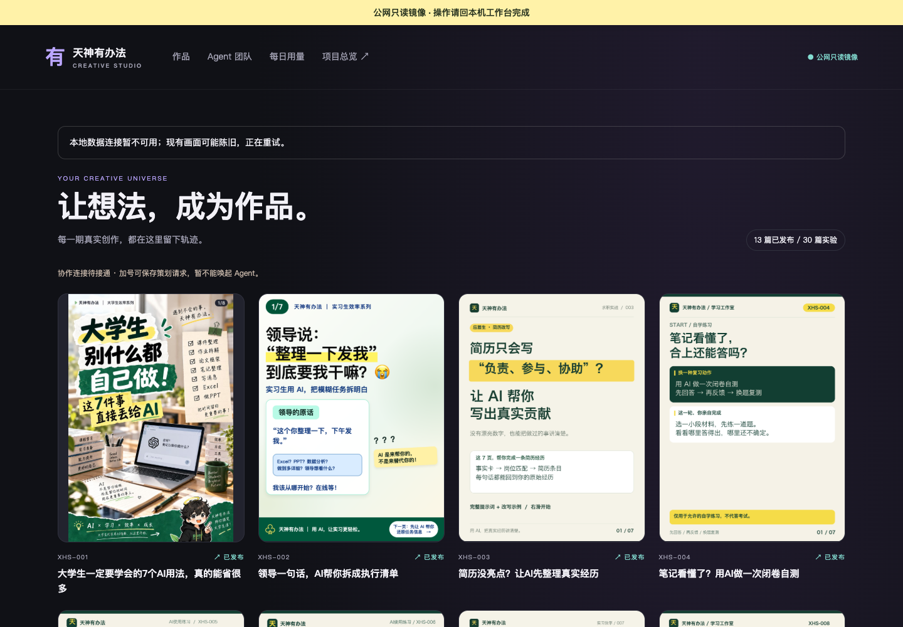
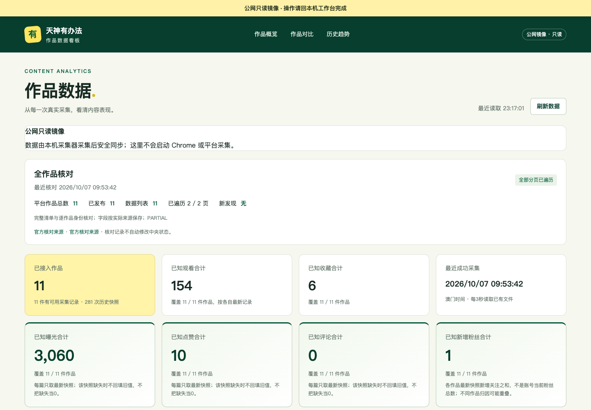

# 天神有办法 · AI Content Studio

一套真实运行的 AI 内容运营工作台：把作品归档、Agent 协作、内容进度和平台数据放进两个统一的网页界面。

[在线体验：创作工作台](https://workbench-43-135-2-155.sslip.io/) · [在线体验：作品数据看板](https://analytics-43-135-2-155.sslip.io/)

> 这是经过脱敏的只读作品展示版。仓库不包含账号 Cookie、平台凭证、真实 Agent threadId、作品 noteId、本机路径、身份证件、内部审批记录或中央档案。





## 作品亮点

- **作品工作台**：按期展示封面、完整图集、正文、发布状态与 44 个协作角色。
- **数据看板**：展示曝光、观看、点赞、收藏、评论、涨粉、点击率和历史趋势。
- **真实数据边界**：缺失值保持缺失，不把未知数据补成 0，不用预测冒充官方数据。
- **响应式设计**：桌面与手机界面均经过真实浏览器回归。
- **零依赖服务端**：Node.js 原生 HTTP 服务，无运行时第三方包。
- **安全优先**：只读路由、路径白名单、严格媒体 ID、CSP、HSTS、无 CORS 和脱敏快照。

## 架构

```text
浏览器
  ├── 创作工作台（作品 / Agent / 用量）
  └── 数据看板（指标 / 对比 / 历史）
          │
          ▼
   Caddy HTTPS 网关
          │
          ▼
  两个只读 Node 服务
          │
          ▼
  脱敏 JSON 快照 + 媒体白名单
```

## 本地运行

需要 Node.js 18 或更高版本。

```bash
npm run start:workbench
```

另开一个终端：

```bash
npm run start:analytics
```

打开：

- `http://127.0.0.1:4317/`
- `http://127.0.0.1:4318/`

也可以使用 Docker Compose：

```bash
docker compose up
```

## 目录

```text
apps/workbench/    创作工作台前端
apps/analytics/    作品数据看板前端
data/              脱敏只读演示快照
media/             已公开的作品展示素材
deploy/            HTTPS 网关配置示例
docs/screenshots/  桌面与手机验收截图
server.mjs         零依赖只读服务
tests/             安全与接口测试
```

## 安全

生产部署在公开前完成了三轮验证：数据泄露边界、HTTP 攻击面、服务器与 TLS。详见 [安全验收报告](SECURITY_AUDIT_2026-10-07.md) 与 [安全策略](SECURITY.md)。

## 说明

这个仓库用于作品展示。代码、视觉素材、文案和数据保留全部权利，未经许可不得复制、改作、销售或再分发。
